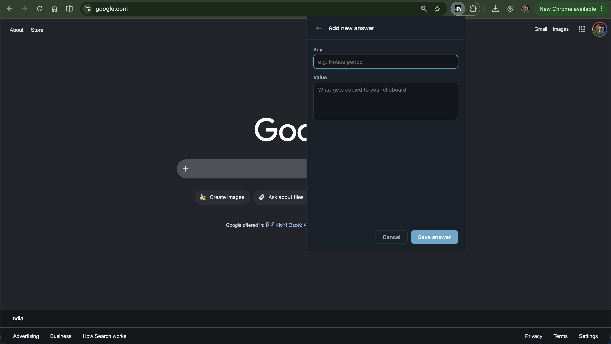
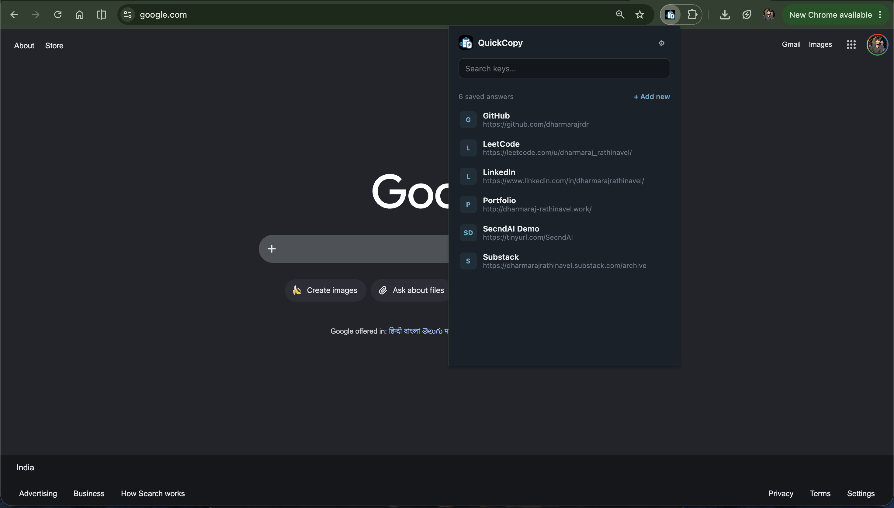
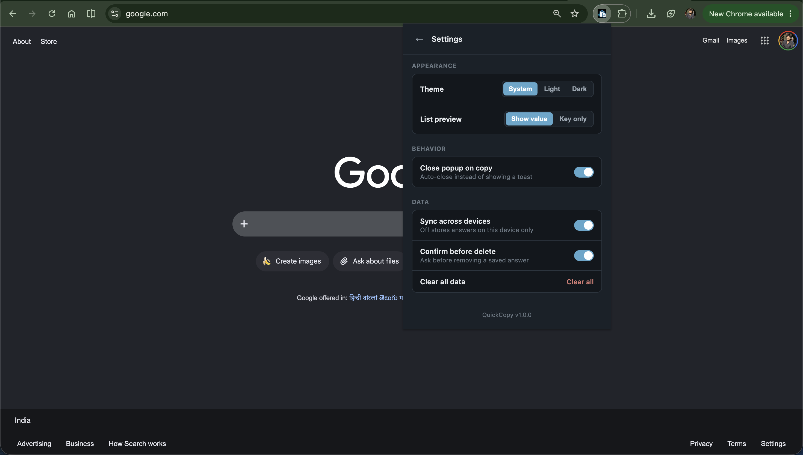

# QuickCopy

A Chrome extension that stores short key/value answers (for job applications) and copies a value to your clipboard with one click.

## Installation

1. Open `chrome://extensions`
2. Turn on **Developer mode** (top right)
3. Click **Load unpacked**
4. Select this `quickcopy` folder
5. Pin the QuickCopy icon from the extensions toolbar menu

No build step — it's plain ES modules, loaded straight by the popup.

## Features

<table>
    <tr>
        <th>Feature</th>
        <th>Description</th>
        <th>Screenshot</th>
    </tr>
    <tr>
        <td>Add new key/value</td>
        <td>Save a key/value pair; both must be unique.</td>
        <td>
            
        </td>
    </tr>
    <tr>
        <td>List view</td>
        <td>Search, click a key to copy the corresponding value.</td>
        <td>
            
        </td>
    </tr>
    <tr>
        <td>Settings</td>
        <td>Customize the extension's behavior and appearance.</td>
        <td>
            
        </td>
    </tr>
</table>

### Usage

- Keys and values must both be **unique** (case-insensitive, trimmed). Save is blocked with an inline error if either collides.
- Delete asks for confirmation by default (toggle in Settings).
- Switching **Sync across devices** on/off in Settings migrates existing answers to the new storage area automatically — nothing is lost.

---

> ⭐ this extension if you like it!